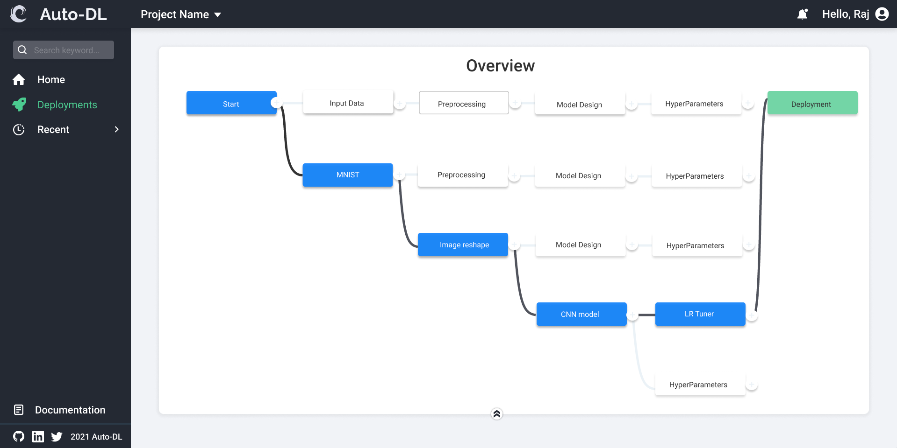

  

  <h4>Introducing the "Futuristic" way of building Deep Learning Models</h4>

  
 

## Auto-DL is just DL but without code.

Building deep learning models may take a lot of time. But not with AutoDL.  
Automate your **meta-work** so that you can focus on building your models without the hassle of writing code.

- **Use our interactive model builder and AI powered suggestion system to quickly whip out a working DL model.**

  

- **Trained your model for multiple hours and found out that it's bugged? Not anymore. With AutoDL's AI ecosystem validate your model before you train it.**

  

- **Host your model just as easily as you created it.**

## Hactoberfest Guidelines

* If an issue is not "assigned," you can assume that no one is working on it (may NOT be true). So to be sure, you can ask the following:
  * Can I take this up?
  * Also, mention a rough deadline until which you plan to fix the issue
  * (Optionally) Potential fixes
DO NOT CREATE a pull request FIRST if someone else is working on it then your efforts might be wasted. Claiming doable and unclaimed issues should be the priority

* Conventional commits in the PR title are a must

* For frontend, while creating a pull request attach a screenshot of the change

* Last but not least, one pull request to fix a typo is fine, but 5 pull requests to remove a stray whitespace is not ([reference](https://hacktoberfest.digitalocean.com/resources/qualitystandards)).

## User Guidelines

The [docs](https://auto-dl.readthedocs.io/en/latest/index.html) are the perfect place for you to start getting used to Auto-DL.

#### Want to setup locally?

* Start with our [getting started docs](https://docs.auto-dl.tech/en/latest/installing.html).

* The doc didn't help? [Join our slack](https://join.slack.com/t/autodl/shared_invite/zt-qagxiwub-ywRM_oBvvF~F7YNtlBqy_Q) and ask your questions!

#### Just want to get a gist of "How to use the application"?

* You can directly jump to the [user guide](https://docs.auto-dl.tech/en/latest/userguide.html) :)

## Developer Guidelines

The [contributing guidelines](https://github.com/Auto-DL/Auto-DL/blob/v1-beta/CONTRIBUTING.md) hosts all the information about building Auto-DL from source, how to contribute code and documentation, who to contact about what, etc.

## Get started with Auto-DL (For Developers)

Setup Auto-DL:

- [Bare-metal way](https://docs.auto-dl.tech/en/latest/installing.html#setup-from-source-code)
- [Using Docker](https://docs.auto-dl.tech/en/latest/installing.html#setup-using-docker)

---

### Features/Enhancements planned

- Improve the UI and UX.

- Show model training realted stats on the frontend.

- Visualization and data preprocessing steps.

- Model Explainability.

## Contact

<!-- Actual text -->

#### You can find us on [![Twitter][1.2]][1] or on [![LinkedIn][2.2]][2] or join our community on [Slack][3].

<!-- Icons -->

[1.2]: http://i.imgur.com/wWzX9uB.png "Twitter"
[2.2]: https://raw.githubusercontent.com/MartinHeinz/MartinHeinz/master/linkedin-3-16.png "LinkedIn"

<!-- Links to our social media accounts -->

[1]: https://twitter.com/auto_dl
[2]: https://www.linkedin.com/company/autodl/
[3]: https://join.slack.com/t/autodl/shared_invite/zt-qagxiwub-ywRM_oBvvF~F7YNtlBqy_Q

#### Have doubts?

Read the [FAQ](#todo) or send us a mail at info@auto-dl.tech

For more details, visit our [website](https://auto-dl.tech/)

---

## Contributors

## Copyright and Licensing

[GNU General Public License v3.0](https://github.com/Auto-DL/Auto-DL/blob/v1-beta/LICENSE)
