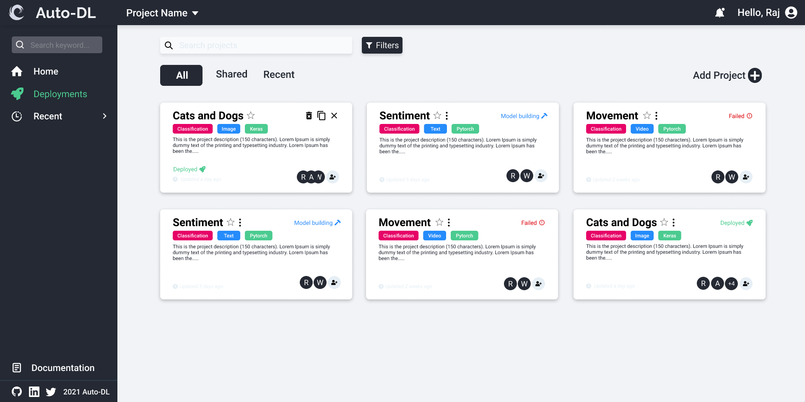
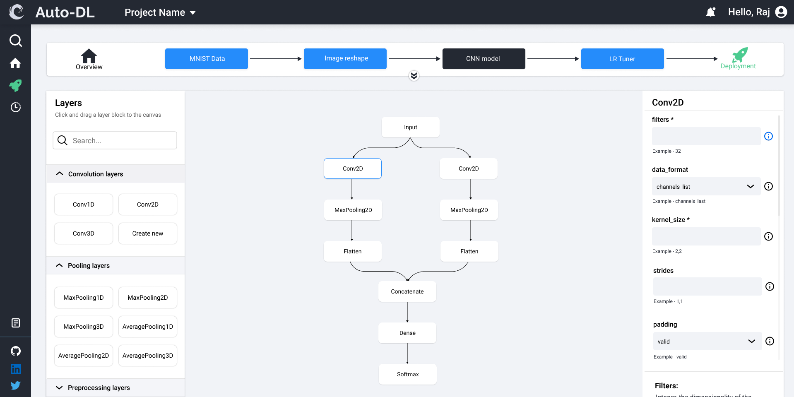
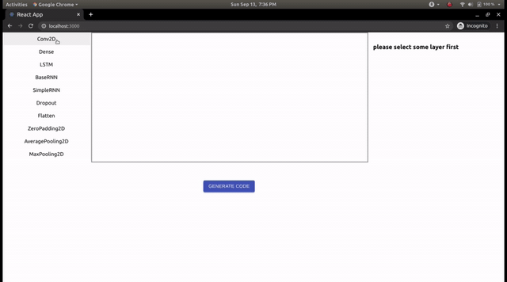

# User Guide

- To use the application you need to follow the steps below successfully install the application and run it

__Downloading the project__
* Go to the : [Auto-DL project](https://github.com/Auto-DL/Generator)
* Click on the green colored Download button (code button)
  Select option which says ```download as zip```

__Extracting__
* After downloading the .zip file, Extract the file using WinZip or any application that can extract the .zip files.
  After extracting the file follow the next steps.

__Installation of the required modules__

* Then go to your Generator folder in the project directory as follows
* Right-click on the project folder and open the properties.
* Copy the path mentioned in the box.

* After copying the path, Go to the terminal of your windows operating system or terminal of the Linux operating system.
* To go to the terminal use search option in windows.
  Type 'cmd' in  the search field.
* Right-click on the command prompt and select "Run as administrator option"

* then type the following command
* <code>cd path</code>
* paste the path you copied in the above command
* Example:
```cd C:\Auto-DL\Generator ```

* There will be a requirements.txt file in the generator folder. It contains a list of the required modules for the successful operation of the application.

* To install the required modules type the following command in terminal
```pip install -r requirements.txt```


__After installation of required modules, you need to install node package manager(npm) to run front end application__
To install npm follow the following steps

* Go to [npm](https://nodejs.org/en/download/) site
* download the package according to your system
* Install by doing simple next-yes-next yes.

__after that go to the path in CMD mentioned below and do the following steps to run the application__

* To start the backend server traverse to the path in cmd.
```\Auto-DL\Generator\BackEnd\```
* Type
```python manage.py server```
This will start the backend server.
```\Auto-DL\Generator\FrontEnd\v1-react```
* after traversing to this path in cmd type
```npm install```
```npm start```
* This will start front end app
* type
<code>http://127.0.0.1:3000</code> in your browser

# How to use the application
- Create account using email-Id if you haven't.
- Login into your account.
- Once you login to your account, screen similar to following image will be shown.





- Click on the + button in the right corner


- Fill in the details of the model which you would like to create.
- After filling in the details save the changes.


- After this following image will be shown to you





- Drag required layers from the left side to the target box
- After dragging all the layers click on the 1st layer in the target box.
- Fill in the details of your required model
- How to fill in the information is given right below the entity.


- After filling in all the information click on the Generate code button.
- It will create the code and store the name.py file in the destination folder.


# Demo

