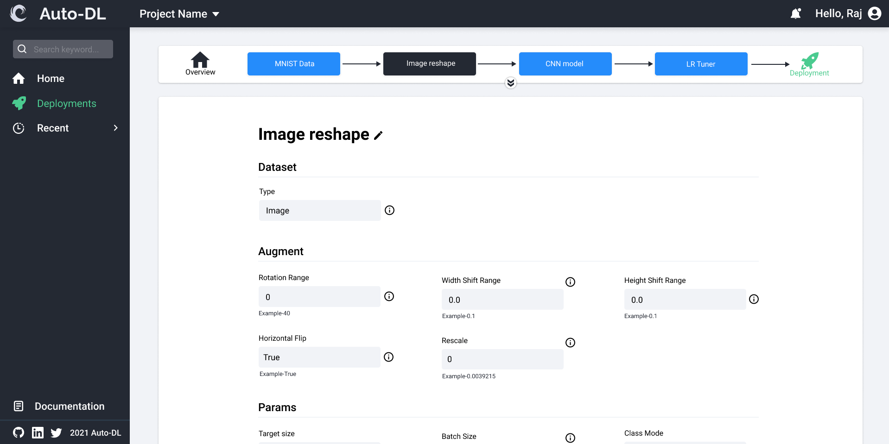
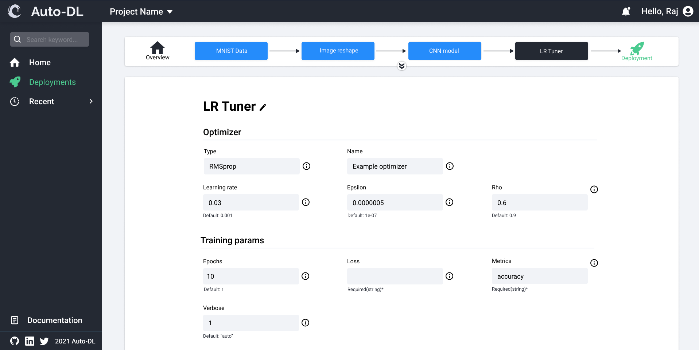

# User Guide

  

- We hope you have installed Auto-DL successfully, if not please go to the [installation](https://auto-dl.readthedocs.io/en/latest/installing.html) process 

# How to use the application
- Create account using email-Id if you haven't.
- Login into your account.
- Once you login to your account, screen similar to following image will be shown.

### Home Page

### Hub

### Pre-processing 

### Model Maker

### Hyperparameter

**NOTE:** Above screenshots are the prototype for v2-UI, which is in development.(FrontEndApp/autodl-platform)
